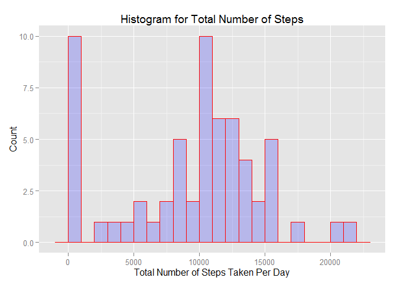
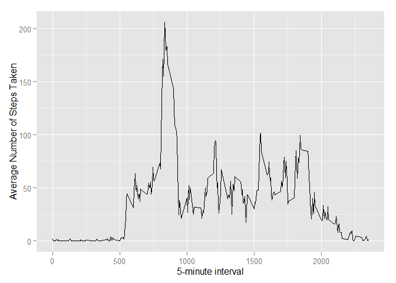
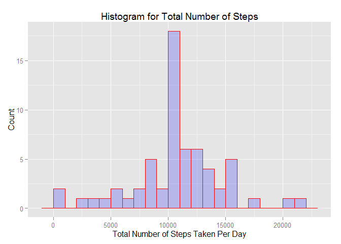
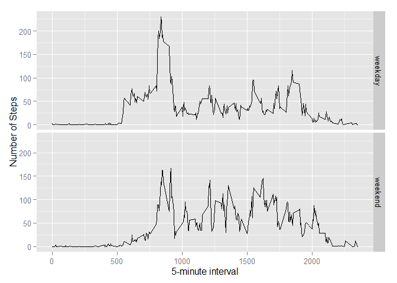

# Reproducible Research: Peer Assessment 1


## Loading and preprocessing the data

```r
dataset <- read.csv("activity\\activity.csv", sep=",", header=TRUE)
```


## What is mean total number of steps taken per day?

```r
library(ggplot2)
```

```
## Warning: package 'ggplot2' was built under R version 3.2.2
```

```r
total_steps <- tapply(dataset$steps, dataset$date, FUN = sum, na.rm = TRUE)
qplot(total_steps, binwidth = 1000, xlab = "Total Number of Steps Taken Per Day", 
      ylab = "Count",geom="histogram",alpha=I(.2),main = "Histogram for Total Number of Steps",fill=I("blue"), 
      col=I("red"))
```

 

```r
mean(total_steps, na.rm = TRUE)
```

```
## [1] 9354.23
```

```r
median(total_steps, na.rm = TRUE)
```

```
## [1] 10395
```


## What is the average daily activity pattern?

```r
library(ggplot2)
averages <- aggregate(x = list(steps = dataset$steps), by = list(interval = dataset$interval), 
                      FUN = mean, na.rm = TRUE)
ggplot(data = averages, aes(x = interval, y = steps)) + geom_line() + xlab("5-minute interval") + 
  ylab("Average Number of Steps Taken")
```

 

Which 5-minute interval, on average across all the days in the dataset, contains the maximum number of steps?

```r
averages[which.max(averages$steps), ]
```

```
##     interval    steps
## 104      835 206.1698
```

## Imputing missing values
There are a number of days/intervals where there are missing values
(coded as NA). The presence of missing days may introduce bias into some
calculations or summaries of the data.

```r
missing_value <- is.na(dataset$steps)
# How many missing
table(missing_value)
```

```
## missing_value
## FALSE  TRUE 
## 15264  2304
```

Use the mean for that 5-minute interval for missing values

```r
fill_value <- function(steps, interval) {
  filled <- NA
  if (!is.na(steps))
    filled <- c(steps)
  else 
    filled <- (averages[averages$interval == interval, "steps"])
  return(filled)
}
filled_data <- dataset
filled_data$steps <- mapply(fill_value, filled_data$steps, filled_data$interval)
```

Make a histogram of the total number of steps taken each day and Calculate
and report the mean and median total number of steps taken per day

```r
total_steps <- tapply(filled_data$steps, filled_data$date, FUN = sum)
qplot(total_steps, binwidth = 1000, xlab = "Total Number of Steps Taken Per Day", 
      ylab = "Count",geom="histogram",alpha=I(.2),main = "Histogram for Total Number of Steps",fill=I("blue"), 
      col=I("red"))
```

 

```r
mean(total_steps)
```

```
## [1] 10766.19
```

```r
median(total_steps)
```

```
## [1] 10766.19
```

These values differ from the estimates from the first part of the assignment.
As we can see, mean and median values are higher after imputing missing data.
Originally, there are some missing value in steps for certain interval.
Thus, total number of steps taken in some days are set to 0 by default.
After using the mean for that 5-minute interval for missing values, 
those 0 values are removed from the histogram of total number of steps taken each day.

## Are there differences in activity patterns between weekdays and weekends?

First, let's create a new factor variable in the dataset with two levels - "weekday"
and "weekend" indicating whether a given date is a weekday or weekend
day.

```r
weekday_or_weekend <- function(date) {
  day <- weekdays(date)
  if (day %in% c("Monday", "Tuesday", "Wednesday", "Thursday", "Friday")) 
    return("weekday") 
  else if (day %in% c("Saturday", "Sunday"))
    return("weekend")
  else 
    stop("invalid date")
}
filled_data$date <- as.Date(filled_data$date)
filled_data$day <- sapply(filled_data$date, FUN = weekday_or_weekend)
```

After that, let's make a panel plot containing plots of average number of steps taken on weekdays and weekends.

```r
averages <- aggregate(steps ~ interval + day, data = filled_data, mean)
ggplot(averages, aes(interval, steps)) + geom_line() + facet_grid(day ~ .) + 
  xlab("5-minute interval") + ylab("Number of Steps")
```

 
